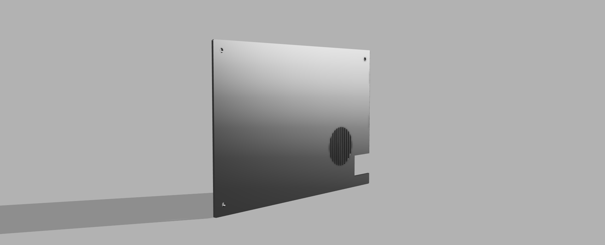
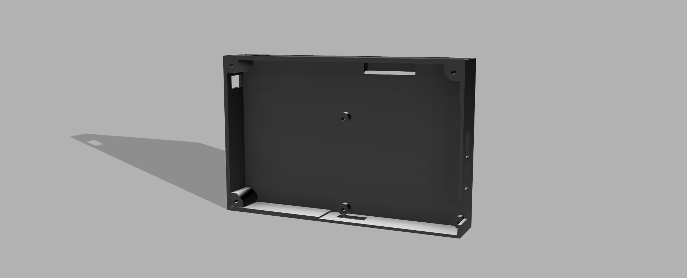

## DIY Portable Windows Tablet Using LattePanda ##
- Project Overview:
This project demonstrates the design and construction of a portable Windows-based tablet (Pocket PC) using a LattePanda single-board computer, a 7-inch IPS display with capacitive touch, and a battery-powered system with proper power management.

The project focuses on hardware integration, power electronics, and system-level design, without using any custom PCB. All components are interconnected using jumper wires and ready-made modules, making the system modular, safe, and easy to troubleshoot.

-  Objectives:

- To build a compact, portable Windows computer
- To understand battery management and voltage regulation
- To interface HDMI display and USB capacitive touch
- To demonstrate a real-world embedded computing system
- To avoid PCB fabrication by using modular hardware

## Reason for Not Using a Custom PCB: ##
- A custom PCB was not designed for this project because the LattePanda board itself is a highly complex and compact single-board computer that requires industrial-level experience to design and manufacture. It involves high-speed signals, multi-layer PCB routing, power management, and strict layout rules that are beyond hobby-level PCB design. Designing a custom PCB for such a system would require advanced tools, professional manufacturing facilities, and expert knowledge, which is not suitable for a school or hobby project. Therefore, using the ready-made LattePanda board is the most practical and safe approach, allowing the project to focus on system integration and learning rather than industrial PCB development.
 
 ## wiring config ##
 | Connection                   | Description             |
| ---------------------------- | ----------------------- |
| Battery → BMS                | 3S series configuration |
| BMS → Buck Converter         | 12V output              |
| Buck Converter → LattePanda  | Regulated 5V supply     |
| Buck Converter → Display     | Regulated 5V supply     |
| LattePanda HDMI → Display    | Video signal            |
| LattePanda USB → Touch Panel | Touch input             |

## Power Management & Safety ##

A 3S BMS ensures:

- Over-charge protection
- Over-discharge protection
- Short-circuit protection
- Cell balancing
- Buck converter prevents over-voltage damage to LattePanda
- All grounds are common
- No battery is connected directly to the system without regulation

## PCB ##
- This project does not require a printed circuit board (PCB) because all the components used in the system, such as the LattePanda board, display, battery management system, and buck converter, are ready-made modules. These components are connected using jumper wires and standard interfaces like HDMI and USB, which makes PCB fabrication unnecessary. However, even without a PCB, the project is not simple. It is quite complex and advanced for a Tier-1 project within the ($0–$400) budget range. The project involves understanding power management, safe handling of lithium batteries, voltage regulation, and integrating multiple hardware components to run a full Windows operating system. Therefore, the complexity of the project lies in design, research, and proper implementation rather than PCB manufacturing, making it a challenging and valuable learning experience.

## Selection of LattePanda and Component Sourcing: ##
- LattePanda was chosen for this project because it is a compact and powerful single-board computer that can run a full Windows operating system, which is not possible with many basic development boards. It combines a mini PC and an Arduino co-processor in one board, making it suitable for advanced projects like a portable Windows tablet. Another major challenge in this project was sourcing all the required components at an affordable price. Components such as the display, touch panel, battery, BMS, and power modules had to be carefully selected to stay within the budget while maintaining reliability and safety. Finding compatible parts at reasonable cost required extensive research and comparison, making component sourcing a significant and important task in the overall project development.
  
## Build Procedure ##

- Assemble 3 × 18650 cells in series and connect to BMS
- Connect BMS output to buck converter input
- Adjust buck converter output to 5.1V
- Power LattePanda and display from buck converter
- Connect HDMI cable between LattePanda and display
- Connect USB cable from touch panel to LattePanda
- Power ON the system and verify functionality

## project overview ##
- This project successfully demonstrates the construction of a DIY portable Windows tablet using a LattePanda SBC. It highlights the importance of safe power management, modular hardware design, and system integration, making it an excellent real-world learning project.

## 3D case ##
- I buit a custom made case for the tab:

- This project was designed to plan the physical layout and arrangement of all components before actual assembly. It includes the placement of the LattePanda board, 7-inch display, battery pack, BMS, and buck converter inside the enclosure. The CAD design helps in understanding the size, spacing, and alignment of components, ensuring proper fit, ventilation, and accessibility to ports. Since no PCB is used in this project, the CAD file mainly focuses on the mechanical design of the enclosure and mounting points rather than circuit routing.

## WIRING CONFIG ##
- The wiring of this project was done carefully to ensure safe and proper operation of all components. The battery pack was first connected to a 3S Battery Management System (BMS) to provide protection against overcharging, over-discharging, and short circuits. The output from the BMS was then connected to a buck converter to reduce the battery voltage to a stable 5V required by the LattePanda board and the display. Power connections were made using jumper wires with a common ground. HDMI cable was used to connect the LattePanda to the display for video output, and a USB cable was used to connect the capacitive touch panel for touch input. Since no PCB was used, extra care was taken to ensure proper insulation, secure connections, and correct polarity, making wiring an important and critical part of the project.

## BOM ##
- final stage of the project, a complete Bill of Materials (BOM) was prepared, listing all the components used along with their specifications and approximate cost. The BOM helped in keeping track of the required parts and ensured that the project stayed within the given budget.

